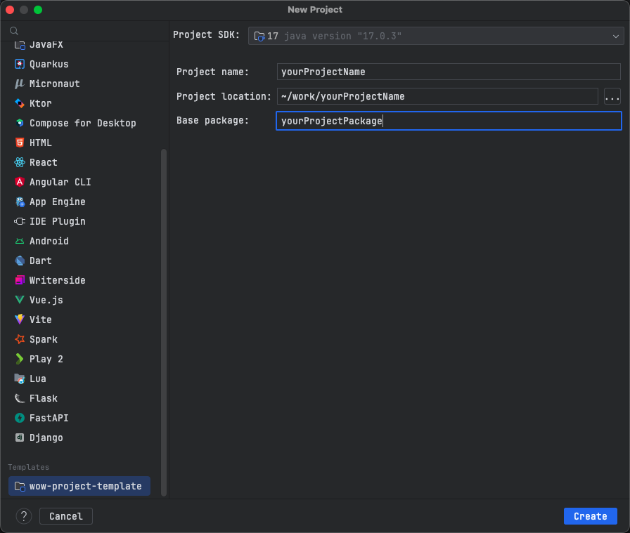
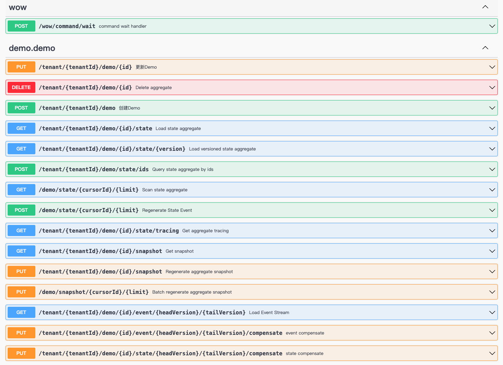
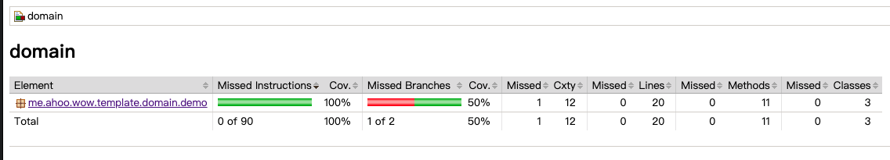
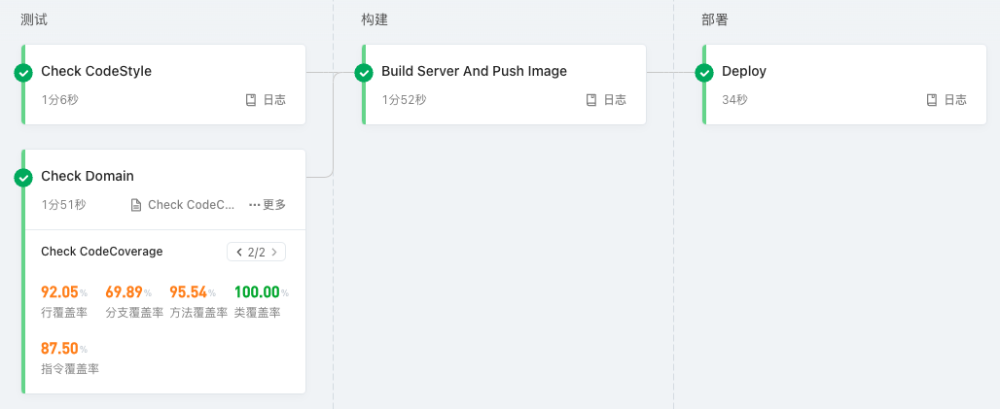
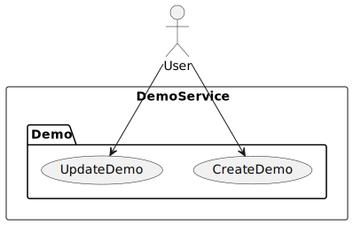

# Wow 项目模版

用于快速构建基于 [Wow 框架](https://github.com/Ahoo-Wang/Wow) 的项目模板。

## 模块介绍

| 模块                                              | 说明                                                                                                                                |
|-------------------------------------------------|-----------------------------------------------------------------------------------------------------------------------------------|
| [api](./api)                                    | **API 层**，定义聚合命令（Command）、领域事件（Domain Event）以及查询视图模型（Query View Model）。充当各个模块之间通信的“发布语言”，同时提供详细的 API 文档，助力开发者理解和使用接口。             |
| [domain](./domain)                              | **领域层**，包含聚合根和业务约束的实现。聚合根充当领域模型的入口点，负责协调领域对象的操作，确保业务规则的正确执行。业务约束包括领域对象的验证规则、领域事件的处理等。模块内附有详细的领域模型文档，助力团队深入了解业务逻辑。                 |
| [server](./server)                              | **宿主服务**，应用程序的启动点。负责整合其他模块，并提供应用程序的入口。涉及配置依赖项、连接数据库、启动 API 服务等任务。此外，server 模块提供了容器化部署的支持，包括 Docker 构建镜像和 Kubernetes 部署文件，简化了部署过程。 |
| [code-coverage-report](./code-coverage-report)  | **测试覆盖率**，用于生成详细的测试覆盖率报告，以及验证覆盖率是否符合要求。帮助开发团队了解项目测试的全面性和质量。                                                                       |
| [dependencies](./dependencies)                  | **依赖项管理**，这个模块负责管理项目的依赖关系，确保各个模块能够正确地引用和使用所需的外部库和工具。                                                                              |
| [bom](./bom)                                    | **项目的 BOM（Bill of Materials）**                                                                                                    |
| [libs.versions.toml](gradle/libs.versions.toml) | **依赖版本配置文件**，明确了项目中各个库的版本，方便团队协作和保持版本的一致性。                                                                                        |
| [deploy](./deploy)                              | **Kubernetes 部署文件**，提供了在 Kubernetes 上部署应用程序所需的配置文件，简化了部署过程。                                                                       |
| [Dockerfile](server/Dockerfile)                 | **server Docker 构建镜像**，通过 Dockerfile 文件定义了应用程序的容器化构建步骤，方便部署和扩展。                                                                   |
| [document](document)                            | **项目文档**，包括 UML 图和上下文映射图，为团队成员提供了对整个项目结构和业务逻辑的清晰理解。                                                                               |

## IDEA 项目模板

[IDEA 项目模板](https://www.jetbrains.com/help/idea/saving-project-as-template.html)

[IDEA 配置目录](https://www.jetbrains.com/help/idea/directories-used-by-the-ide-to-store-settings-caches-plugins-and-logs.html#config-directory)

- IDEA 项目模板目录：`<IDE config home>/projectTemplates`
- 将模板压缩包放到 IDEA 项目模板目录下
    - 模板压缩包: https://github.com/Ahoo-Wang/wow-project-template/releases/download/v0.0.1/wow-project-template.zip
- [使用模板创建项目](https://www.jetbrains.com/help/idea/saving-project-as-template.html#create-project-from-template)
  - 
- 修改 `settings.gradle.kts` 文件，将 `rootProject.name` 修改为项目名称
- 修改 `api/{package}/DemoService`
- 修改 `domain/{package}/DemoBoundedContext`

## 启动服务

<p align="center" style="text-align:center">
  
</p>

> 访问：http://localhost:8080/swagger-ui.html

<p align="center" style="text-align:center">
  
</p>

## 验证测试覆盖率

```shell
gradle domain:jacocoTestCoverageVerification
```

> 查看测试覆盖率报告：`domain/build/reports/jacoco/test/html/index.html`

<p align="center" style="text-align:center">
  
</p>

## CI/CD 流水线

<p align="center" style="text-align:center">
  
</p>

### 测试阶段

> 代码风格检查(Check CodeStyle)

```shell
./gradlew detekt
```
> 领域模型单元测试 (Check Domain)

```shell
./gradlew domain:check
```
> 测试覆盖率验证(Check CodeCoverage)

```shell
./gradlew domain:jacocoTestCoverageVerification
```
### 构建阶段

> 生成部署包 (Build Server)

```shell
gradle server:installDist
```

> 发布 Docker 镜像 (Push Image)

[Dockerfile](server/Dockerfile)

### 部署阶段

> 部署到 Kubernetes (Deploy Kubernetes)

[deploy](./deploy)

### 流水线配置

```yaml

```

## 设计文档

### 用例图

<p align="center" style="text-align:center">
  
</p>